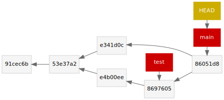

# cs1302-gitdot

```
*   86051d8 (HEAD -> main) Merge branch 'test'
|\
| * 8697605 (test) upate readme again
| * e4b00ee added things
* | e341d0c added stuff
|/
* 53e37a2 adde header to README
* 91cec6b initial commit
```



## Usage

```sh
$ gitdot.sh
```

```
$ gitdot.sh | dot -Tsvg > output.svg
```
