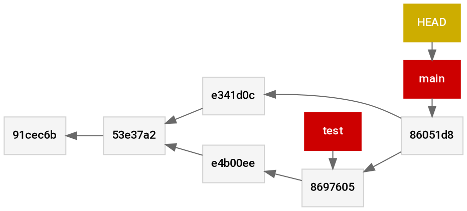

# cs1302-gitdot

```
*   86051d8 (HEAD -> main) Merge branch 'stuff-and-things'
|\
| * 8697605 (test) upate readme again
| * e4b00ee added things
* | e341d0c added stuff
|/
* 53e37a2 adde header to README
* 91cec6b initial commit
```

| Node   | Label     | Parents    |
|--------|-----------|------------|
| `c1`   | `91cec6b` |            |
| `c2`   | `53e37a2` | `c1`       |
| `c3`   | `e341d0c` | `c2`       |
| `c4`   | `e4b00ee` | `c2`       |
| `c5`   | `8697605` | `c3`       |
| `c6`   | `86051d8` | `c3`, `c5` |
| `b1`   | `main`    | `c6`       |
| `b2`   | `test     | `c5`       |
| 'head` | `HEAD`    | `b1`       |


